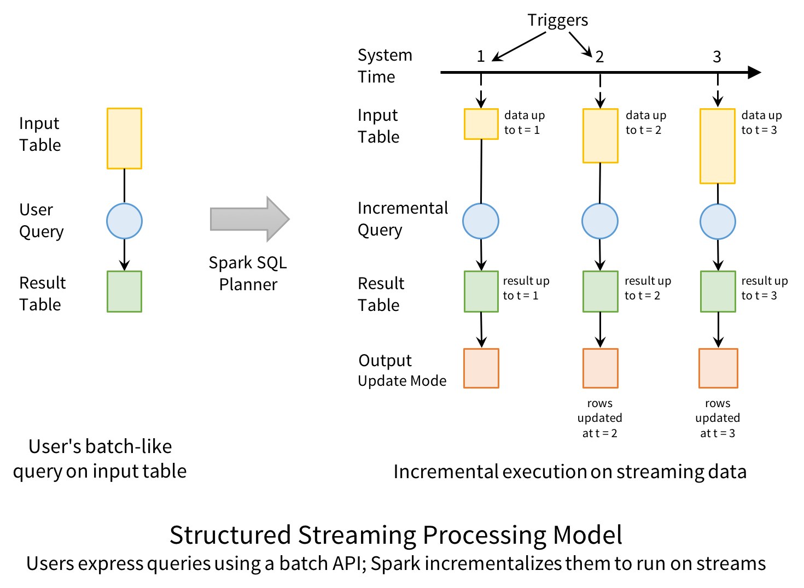
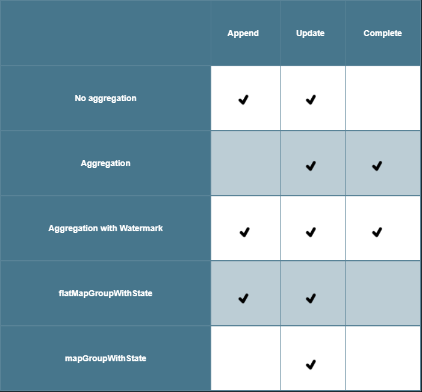
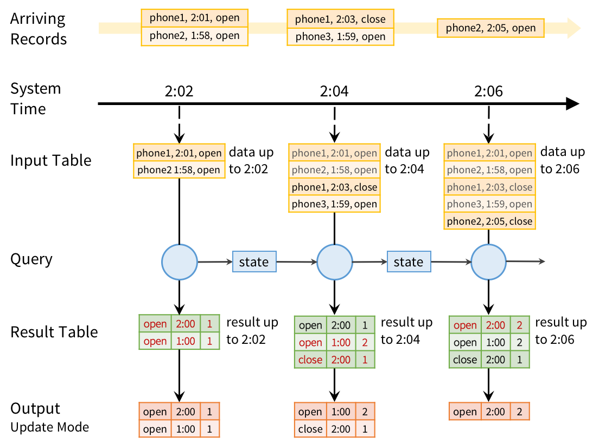

# Structured Streaming

**Structured Streaming** is Sparks new version of Stream processing.
Not to be confused with the old *Spark Streaming* which used a
"discretized stream or DStream".

[Spark Api guide](https://spark.apache.org/docs/latest/structured-streaming-programming-guide.html)

- Not true streaming*
- Micro batching
- Uses DataFrame APIs.

* True stream processing would handle each
input item individually.

### Why micro batching?

Micro batching enables processing to be done in almost (see [restrictions](#restrictions)) the same way
that it would be done with static data.

The **powerful** consequence of this is that the **same queries** can be applied
to both streaming and static data - thereby accelerating the development
process through reusability and a smaller api/process to understand.

## Input and output

- input treated as an **Unbounded table** (i.e. infinite)
- output to a **Result Table** which is consumed by a **sink**
- source is one of: **files**, **Kafka**, **socket** (for testing)
- sink is one of: **file**, [foreach](#foreach-sink), **console** (for testing),
**memory** (for testing)

#### Input data flow diagram:
- This describes how input is **immediately** handled - before a query is run.

## Output modes

There are three output modes which may or may not be applicable
depending on the query that is to be executed.

In describing the modes, it is helpful to keep in mind the **Result Table**
which are the results that will be written to the sink.

### The Three Modes

#### Complete
 - whole Result Table is output
 - can only be done with aggregation queries - since otherwise
 **all state** has to be maintained!
 - from the **sinks** perspective, can be thought of as re-writing the
 entire table of results after every trigger

#### Update
 - only rows in the Result Table that are **new** or have **changed** are output
 - All query types supported, but requires the **sink** to handle
 *in place* updates

#### Append
 - only the **new** rows added to the Result Table (since the last trigger)
 are output to the sink
 - only supports queries where the rows added to the Result Table are
  never going to change
 - with aggregation queries, this mode incurs a delay* when compared to *Update*

* See [Examples](#examples) and [Watermarking - append](#append-mode-delay)

#### Supported query types

The following table shows the query types that are possible in each mode.

## Watermarking

Watermarking allows late data to be included in a windowed aggregation,
while also providing a cut-off point after which **old state** can be
**dropped** - as it is no longer required.

This is done by tracking the most recent **event-time** *independently*
from the **current system time**.

A threshold is set with
`.withWatermark(<event-time-col>, <duration>)`
e.g. `.withWatermark("timestamp", "10 minutes")`.

To understand exactly how watermarking works in Spark there are a few key
details to note.

1. We set a `late_threshold` = some amount of time
1. The `watermark` is **recalculated** at each point that the
`current_system_time` progresses to the **start of the next window**.
1. Spark keeps track of the `max_event_time` **seen** in the stream so far

##### watermark recalculation:

**when** `current_system_time == window_start`,

        watermark = max_event_time - late_threshold

-----

#### Append mode delay

When using the append mode and watermarking there is a necessary delay
in seeing output - in comparison to the Update mode.

This is due to the nature of appending, since a row can
only be written to the Result Table (and therefore sink) after
it is certain that *no further modifications* to that row are *possible*.

When aggregating with Append mode, it is **not possible** to do **plain
aggregation** since we would never be allowed to write to the
Result Table (unless the stream is complete!). We need a mechanism for
being able to certify that a row is not going to change as the result
of new data.

With watermarking there becomes a point in time, a **cut-off point** after
which new data that would otherwise change a row is now ignored. To
understand when this cut-off point will occur you need to consider the
row's time window.

##### Row can be written to Result Table when:

    row_window_end <= watermark

since *any new data* that has an *event-time* **within** the
*row's time window* will now be ignored.

(Note that the diagram on the Spark programming guide that illustrates
this appears to be wrong in suggesting the Result Table is updated one
trigger *later* than should be possible.)

See the [example](#append-mode-aggregation-with-watermark) for more.

#### Watermarking notes and tips

- Aggregation must be done on the same timestamp column as is used for
watermarking

- `.withWatermark` must be called **before** doing the aggregation

- events *ahead of the current time* will push forward the watermark.
Consider the case where it is possible to receive events with inaccurate
event times (e.g. a mobile device providing its own timestamp - with incorrect system time)
then your watermark could become much more restrictive (a tighter cut-off)
than anticipated.

## Examples

#### Update mode aggregation with window

- The following example is for Open/Close events that describe users
opening or closing a mobile application
- The aggregation window duration is 1 min
- The query counts how many open/close events occurred within the time window
- Red text shows changes to the result table
- The batch is triggered every 2 seconds

#### Append mode aggregation with watermark

Take the same scenario as described above. We need to create a cut-off
point by when we can say *"there will be no more changes to these rows"*.
To do that we have to aggregate our events into time windows, but that is
not enough because there can always be late data, so how do we know when to
stop updating our state and that we can commit to the Result Table?
By using watermarking we define a cut-off point in real time, after which
we will ignore late data.

For example, take a window of time for events between `8am` and `9am`.
If we say that we will stop accepting late data at `11am`, then when it
gets to 11am we output all the new rows that were formed from open/close
events that had an event-time between `8am` and `9am`.

Output written at `11am`:

        open    8:00    21
        close   8:00    17

At `11:01` we get another event: `phone 42, 8:59, close` - but we don't
update our results... It's as if we didn't see this event at all.

At `11am` the state for all events between `8` and `9` can be cleared.

## Restrictions

- It is not possible to perform more than one aggregation in a single
query, e.g `.agg(..).agg(..)`

- Can't use: `count`, `foreach`, `show` operations
when they would normally force computation of a result

- `limit`, `take` unsupported

- `sort` can't be done except after aggregation in **complete** mode.
Since it would require to keep all data in state (hence it working
in the described scenario)

- outer joins (with a static Dataset) are conditionally supported (see api guide)

- joining 2 streams is unsupported

- With a **file source** a schema is required.
However, for ad-hoc use cases, you can re-enable schema inference
by setting:

        spark.sql.streaming.schemaInference = true

## mapGroupsWithState and flatMapGroupsWithState

These query types are used for doing **arbitrary stateful operations**.

Often for session-related data there is a need to save arbitrary types
of data as state, and perform arbitrary operations on that state.
Both operations allow you to apply user-defined code on grouped Datasets
to update user-defined state. For more see the [API docs](https://spark.apache.org/docs/latest/api/scala/index.html#org.apache.spark.sql.streaming.GroupState)
and [spark's examples](https://github.com/apache/spark/blob/v2.2.0/examples/src/main/scala/org/apache/spark/examples/sql/streaming/StructuredSessionization.scala)

## foreach sink

The `foreach` operation allows arbitrary operations to be computed on the
output data.

You have to implement the interface `ForeachWriter`. It processes the new
output from the Result Table on each trigger.

It must be:
- serializable
- implement `open`, `process`, `close`
- in `open`, the batch **version** and **partition** numbers identify
the set of rows and can be used to choose whether or not to write the rows.

## Misc Considerations/ guidelines

- complete mode is suitable when the aggregated results will be a "small"
finite number of rows.

- state is held in memory

- consider when state will be cleaned and the likely size that state
might need to grow to be.

- the size of the state required is different for different output modes
and smaller time windows with more restrictive watermarking will reduce
state.

- with *files as a source*, the files need to be added to the directory
atomically. As is the case with the `mv` command.

- de-duplication - this is the same as it is normally with static data,
the difference here is that in order to perform de-duplication the relevant
data needs to be held in state. Therefore, use watermarking to reduce what
state is required. Usage: `.dropDuplicates("guid", "eventTime")`

